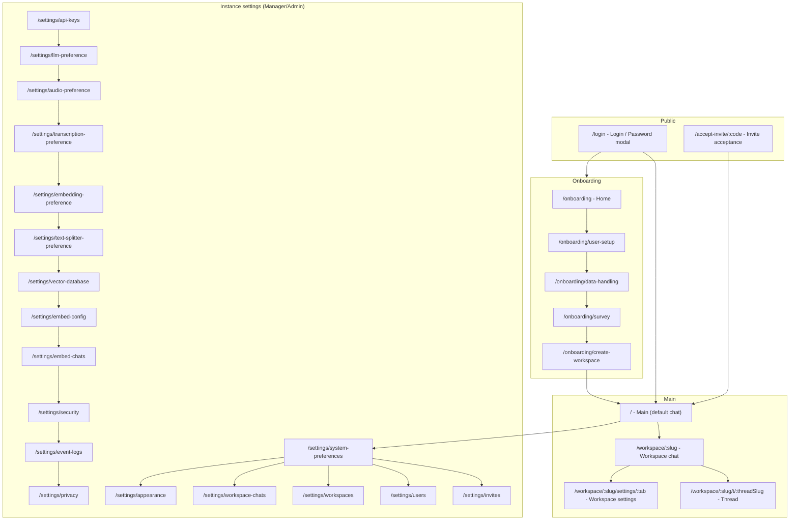
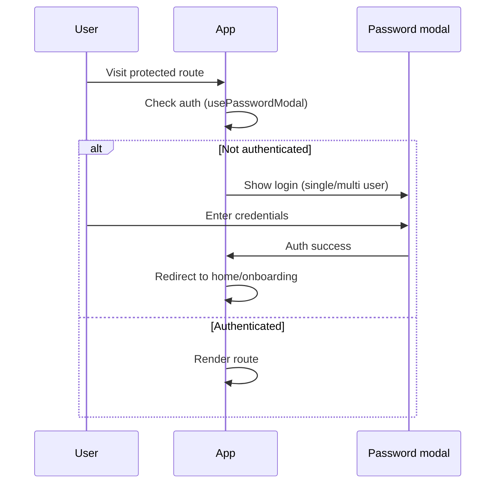
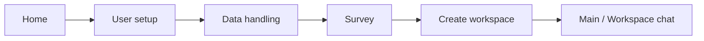
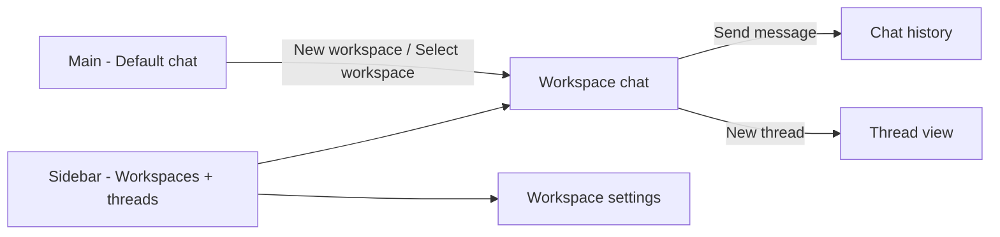

# ChatbotAI — Application Wireframe

High-level structure, flows, and screen layouts for the ChatbotAI (workspace-based LLM chat) application.

---

## 1. Application overview

- **Product**: Workspace-based AI chat with RAG (vector DB), agents, multi-user roles (admin/manager/default), and embeddable widgets.
- **Entry**: Login (password modal) → Home or Onboarding (first-time) → Main (default chat) or Workspace Chat.
- **Roles**: Default (chat only), Manager (workspace + instance settings), Admin (full instance + API/LLM/embed).

---

## 2. Sitemap



---

## 3. User flows

### 3.1 Authentication



### 3.2 First-time / Onboarding



### 3.3 Chat flow



---

## 4. Screen wireframes

### 4.1 Login (`/login`)

```
┌─────────────────────────────────────────────────────────────────┐
│                                                                  │
│                        [ Full-screen overlay ]                   │
│                                                                  │
│              ┌─────────────────────────────────────┐             │
│              │         Password modal              │             │
│              │  ┌─────────────────────────────┐    │             │
│              │  │  [Logo / App name]          │    │             │
│              │  └─────────────────────────────┘    │             │
│              │  [Username field]  (if multi-user)  │             │
│              │  [Password field]                   │             │
│              │  [Login / Submit]                    │             │
│              │  (optional: connection error toast)  │             │
│              └─────────────────────────────────────┘             │
│                                                                  │
└─────────────────────────────────────────────────────────────────┘
```

---

### 4.2 Main — Home / Default chat (`/`)

```
┌──────────────────┬────────────────────────────────────────────────────────────┐
│  [Logo]          │                                                            │
│  (link → /)      │                                                            │
├──────────────────┤                  Main content area                         │
│ ┌──────────────┐ │  ┌─────────────────────────────────────────────────────┐  │
│ │ + New        │ │  │  Welcome / system messages (ChatBubbles)              │  │
│ │   Workspace  │ │  │  or                                                    │  │
│ └──────────────┘ │  │  [ Create your first workspace ]  (if no workspaces)   │  │
│                  │  │                                                         │  │
│  Workspace 1     │  └─────────────────────────────────────────────────────┘  │
│  Workspace 2     │                                                            │
│  ...             │                                                            │
│                  │                                                            │
│  ─────────────   │                                                            │
│  [Footer icons]  │                                                            │
│  Docs · GitHub   │                                                            │
│  Discord         │                                                            │
│  [Settings ⚙]   │                                                            │
└──────────────────┴────────────────────────────────────────────────────────────┘
     Sidebar              DefaultChatContainer (rounded card, border)
```

---

### 4.3 Workspace chat (`/workspace/:slug`)

```
┌──────────────────┬────────────────────────────────────────────────────────────┐
│  [Logo]          │                                                            │
├──────────────────┤  ┌─────────────────────────────────────────────────────┐   │
│ + New Workspace  │  │  [Workspace name / context]                           │   │
│                  │  │  Chat history (user / assistant bubbles, markdown,   │   │
│ ► Workspace A    │  │  citations, charts, code blocks)                      │   │
│   ├ Thread 1     │  │  …                                                    │   │
│   ├ Thread 2     │  │  [Suggested messages chips] (optional)               │   │
│   └ (current)    │  │  ┌───────────────────────────────────────────────┐   │   │
│   [⚙] [Upload]  │  │  │ Prompt input (textarea, send, stop, voice,    │   │   │
│  Workspace B    │  │  │ text size, etc.)                               │   │   │
│  ...            │  │  └───────────────────────────────────────────────┘   │   │
│  ─────────────   │  └─────────────────────────────────────────────────────┘   │
│  Footer + ⚙     │              ChatContainer                                   │
└──────────────────┴────────────────────────────────────────────────────────────┘
```

---

### 4.4 Workspace settings (`/workspace/:slug/settings/:tab`)

```
┌──────────────────┬────────────────────────────────────────────────────────────┐
│  [Logo]          │  [← Back to workspace]                                      │
│  Sidebar         │  ─────────────────────────────────────────────────────────  │
│  (same as above) │  [ General Settings ] [ Chat Settings ] [ Vector Database ]  │
│                  │  [ Members ] [ Agent Configuration ]                          │
│                  │  ─────────────────────────────────────────────────────────  │
│                  │                                                             │
│                  │  Tab content area (tab-dependent):                           │
│                  │  • General: name, avatar, suggested messages, delete       │
│                  │  • Chat: model, mode, temp, prompt, refusal, history         │
│                  │  • Vector DB: identifier, count, similarity, snippets, reset│
│                  │  • Members: list, add member, roles                          │
│                  │  • Agent: LLM, skills, SQL, web search                       │
│                  │                                                             │
└──────────────────┴────────────────────────────────────────────────────────────┘
```

---

### 4.5 Instance settings (e.g. `/settings/appearance`)

```
┌──────────────────┬────────────────────────────────────────────────────────────┐
│  [Logo] → home   │                                                            │
│  Instance        │                                                            │
│  Settings        │  ┌─────────────────────────────────────────────────────┐   │
│  ─────────────   │  │  Page content (varies by route)                      │   │
│  System Prefs    │  │  • Appearance: theme, custom app name, etc.          │   │
│  Invitation      │  │  • API Keys, LLM Preference, Audio, Transcription    │   │
│  Users           │  │  • Embedder, Text splitter, Vector DB                │   │
│  Workspaces      │  │  • Embed config, Embed chats, Security, Logs        │   │
│  Workspace Chat  │  │  • Privacy & Data                                    │   │
│  Appearance      │  └─────────────────────────────────────────────────────┘   │
│  API Keys        │                                                            │
│  LLM Pref        │  (SettingsSidebar + main content; no workspace sidebar)    │
│  ...             │                                                            │
│  Event Logs      │                                                            │
│  Privacy & Data  │                                                            │
│  ─────────────   │                                                            │
│  Footer          │                                                            │
└──────────────────┴────────────────────────────────────────────────────────────┘
```

---

### 4.6 Onboarding (e.g. `/onboarding/user-setup`)

```
┌─────────────┬───────────────────────────────────────────────┬─────────────┐
│   [ ← ]     │                                                │   [ → ]     │
│   Back      │  ┌─────────────────────────────────────────┐   │   Next      │
│             │  │  Step title (e.g. "User setup")         │   │             │
│             │  │  Step description                        │   │             │
│             │  └─────────────────────────────────────────┘   │             │
│             │                                                │             │
│             │  Step-specific content:                        │             │
│             │  • Home: welcome, get started                  │             │
│             │  • User setup: profile / account               │             │
│             │  • Data handling: policy / consent             │             │
│             │  • Survey: questions                           │             │
│             │  • Create workspace: name, create              │             │
│             │                                                │             │
└─────────────┴───────────────────────────────────────────────┴─────────────┘
                    Centered column, back/forward nav
```

---

### 4.7 Invite acceptance (`/accept-invite/:code`)

```
┌─────────────────────────────────────────────────────────────────┐
│                                                                  │
│              Invite page: show invite details,                    │
│              [Accept] / [Decline] → then redirect (e.g. home)    │
│                                                                  │
└─────────────────────────────────────────────────────────────────┘
```

---

## 5. Key UI components (summary)

| Area            | Components |
|-----------------|------------|
| Shell           | `PrivateRoute`, `AdminRoute`, `ManagerRoute`, `UserMenu`, `PasswordModal` |
| Layout          | `Sidebar`, `SidebarMobileHeader`, `Footer`, `SettingsButton`, `SettingsSidebar` |
| Home            | `DefaultChat`, `ChatBubble`, `NewWorkspaceModal` |
| Workspace list  | `ActiveWorkspaces`, `ThreadContainer`, `ThreadItem` (workspace + thread links, gear, upload) |
| Chat            | `WorkspaceChat` → `ChatContainer` → `ChatHistory`, `PromptInput` (send, stop, voice, text size), citations, charts |
| Workspace cfg   | `WorkspaceSettings` + tabs: `GeneralAppearance`, `ChatSettings`, `VectorDatabase`, `Members`, `AgentConfig` |
| Instance cfg    | `SettingsSidebar` + lazy-loaded pages (Appearance, ApiKeys, LLM, etc.) |
| Onboarding      | `OnboardingFlow`, `OnboardingLayout`, steps: `Home`, `UserSetup`, `DataHandling`, `Survey`, `CreateWorkspace` |

---

## 6. Responsive notes

- **Desktop**: Sidebar always visible; main content in rounded card with margin.
- **Mobile**: Sidebar hidden; `SidebarMobileHeader` (hamburger + logo) at top; overlay/drawer for sidebar when opened.
- **Settings on mobile**: `SettingsSidebar` as drawer; same nav items.

---

## 7. Route reference (quick)

| Route | Purpose |
|-------|--------|
| `/` | Main / default chat |
| `/login` | Login (password modal) |
| `/onboarding`, `/onboarding/:step` | Onboarding flow |
| `/workspace/:slug` | Workspace chat |
| `/workspace/:slug/t/:threadSlug` | Specific thread |
| `/workspace/:slug/settings/:tab` | Workspace settings (general-appearance \| chat-settings \| vector-database \| members \| agent-config) |
| `/accept-invite/:code` | Invite acceptance |
| `/settings/*` | Instance settings (system, invites, users, workspaces, appearance, api-keys, llm-preference, etc.) |

---

*Wireframe derived from the ChatbotAI frontend structure (App.jsx, pages, Sidebar, WorkspaceChat, WorkspaceSettings, OnboardingFlow, SettingsSidebar).*
